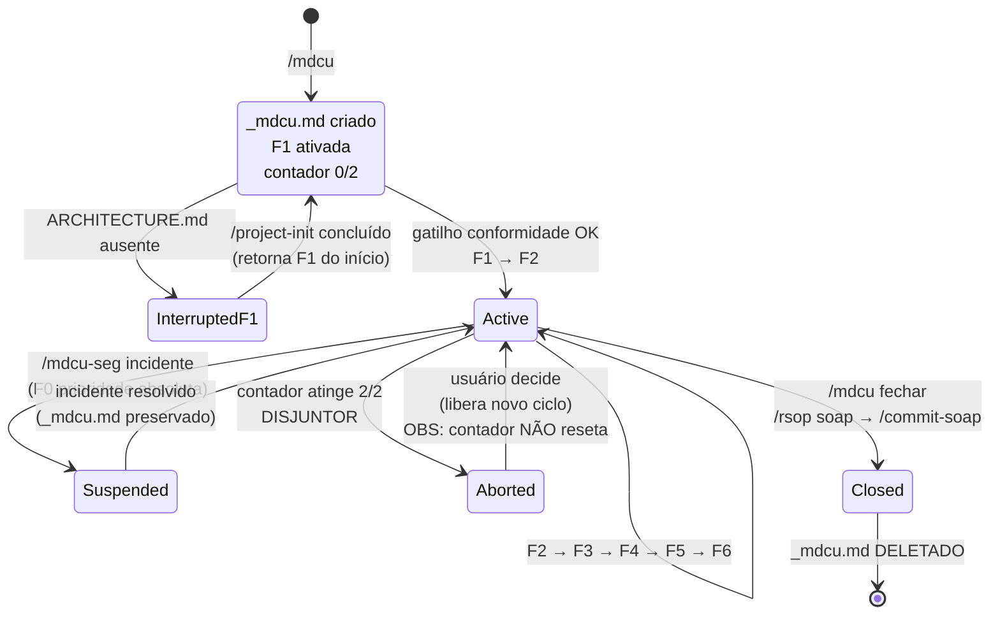
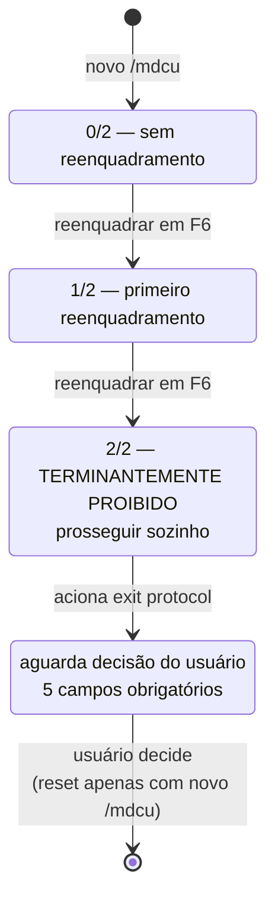
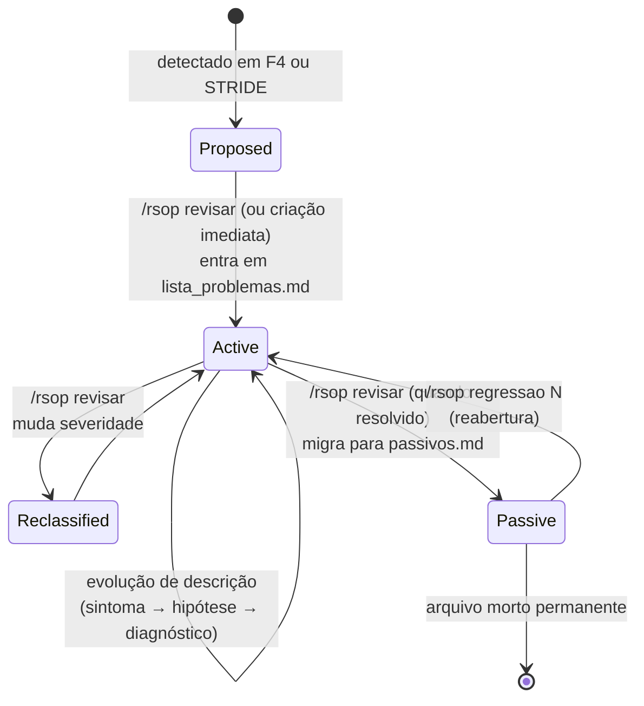
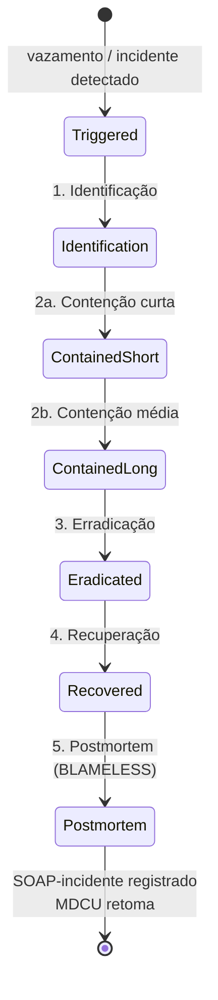
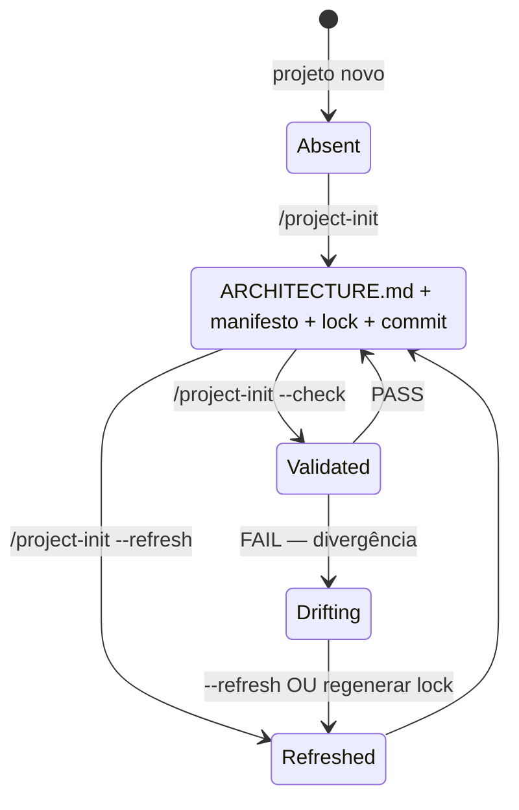
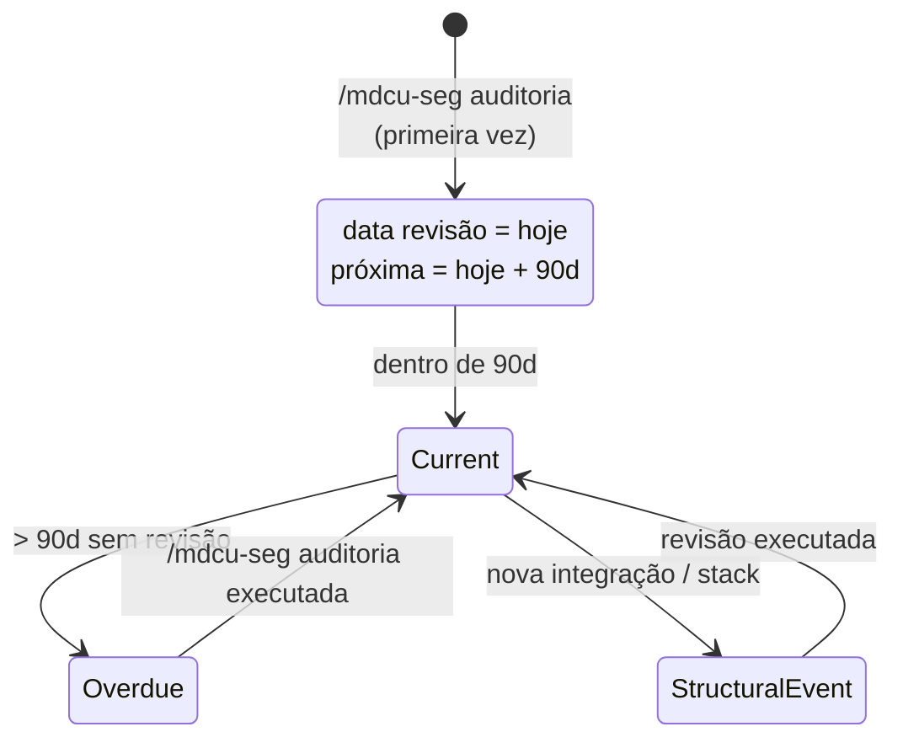

# Máquinas de Estado Canônicas — mdcu-framework

Este documento descreve os fluxos de estado prescritivos sobre artefatos, contadores e protocolos do framework. A implementação de cada fluxo é forçada nas respectivas `SKILL.md` (agentes de execução).

## SM-1 — Sessão MDCU (`_mdcu.md`)


## SM-2 — Contador do Disjuntor (F6)


## SM-3 — Ciclo de vida de um problema RSOP


## SM-4 — Protocolo F0 de Incidente (mdcu-seg)


## SM-5 — Estado do `ARCHITECTURE.md`


## SM-6 — Auditoria de Segurança (`rsop/seguranca.md`)


## SM-7 — Mensagem de Commit
```mermaid
stateDiagram-v2
  [*] --> Choice: hora de commitar
  Choice --> CheckSoap: /commit-soap solicitado
  Choice --> StandardCommit: micro-commit técnico
  CheckSoap --> SoapMissing: nenhum SOAP na sessão
  CheckSoap --> SoapPresent: SOAP encontrado
  SoapMissing --> [*]: ABORTA
  SoapPresent --> Drafted: extrai A+P → formata + Refs:
  Drafted --> Reviewed: exibe ao usuário
  Reviewed --> Committed: confirma → git commit
  Reviewed --> Cancelled: rejeita
  Reviewed --> DryRun: --dry-run
  Reviewed --> Amended: --amend
  StandardCommit --> [*]: git commit padrão
  Committed --> [*]
```
